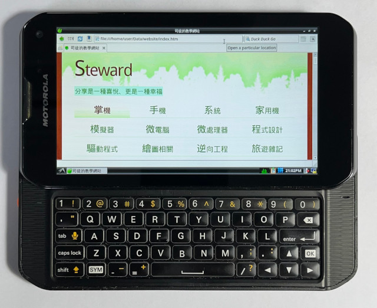
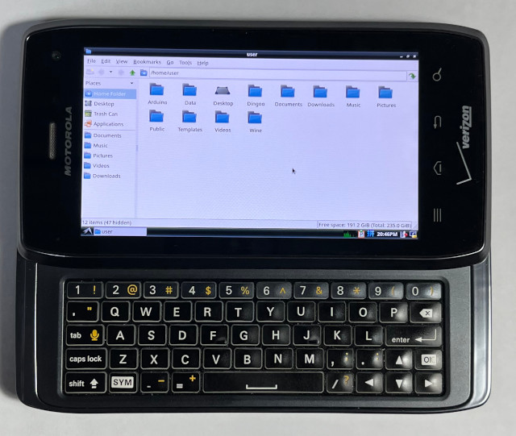

# VNC client ported to SailfishOS
You can now run Debian 12 on the XT897/XT894 smartphone using a chroot environment with a VNC server, and access it through a VNC client running on SailfishOS.  

## Introduction
Due to the lack of mainstream kernel support for the Motorola XT897/XT894 smartphones, SailfishOS containers cannot run properly on these devices. To work around this limitation and enable the use of Debian 12 (Bookworm), I utilize a chroot environment combined with a VNC server. However, the default VNC client available on SailfishOS did not meet the specific requirements for this setup. To address this, I ported a VNC client based on the LibVNC example, tailored specifically for the XT897/XT894. Additional features were implemented, including full keyboard and mouse input support. This repository is intended exclusively for use on the XT897/XT894 and has only been tested with SailfishOS versions 4.4.0.68 and 5.0.0.67. On SailfishOS, rendering is handled by a Wayland client using OpenGL ES 2.0, with a fixed display resolution of 960×540.

## Preparing Debian 12 (PC)
```
$ cd
$ sudo apt-get install binfmt-support qemu qemu-user-static debootstrap

$ wget https://ftp-master.debian.org/keys/release-12.asc -qO- | gpg --import --no-default-keyring --keyring ./debian-release-12.gpg
$ sudo debootstrap --keyring=./debian-release-12.gpg --arch armhf --foreign bookworm bookworm http://ftp.debian.org/debian/
$ sudo chroot bookworm /debootstrap/debootstrap --second-stage

$ sudo mount -o bind /dev bookworm/dev
$ sudo mount -o bind /sys bookworm/sys
$ sudo mount -o bind /proc bookworm/proc

$ sudo chroot bookworm
# passwd
# adduser user
# nano /etc/apt/sources.list
    deb http://deb.debian.org/debian bookworm main contrib non-free non-free-firmware
    deb http://deb.debian.org/debian bookworm-updates main contrib non-free non-free-firmware
    deb http://deb.debian.org/debian bookworm-backports main contrib non-free non-free-firmware
    deb http://archive.debian.org/debian/ buster contrib main non-free

# apt-get update
# apt-get install task-lxde-desktop lxde-core lxde obconf openbox lxdm lxde-common tightvncserver -y
```

## Building VNCClient (SailfishOS)
```
$ cd
$ git clone https://github.com/steward-fu/vncclient
$ mkdir vncclient/build
$ cd vncclient/build
$ cmake ..
$ make
$ sudo cp examples/client/vncclient /usr/local/bin
$ sudo chmod 0777 /usr/local/bin/vncclient

$ sudo vim /usr/local/bin/debian 
    #!/bin/bash
    MYDIR=/sdcard/bookworm
    ACT=$1

    if [ `whoami` != "root" ]; then
        echo "run me as root"
        exit
    fi

    if [ "$ACT" == "mount" ]; then
        mount --rbind /dev $MYDIR/dev
        mount --bind /sys $MYDIR/sys
        mount --bind /proc $MYDIR/proc
    fi

    if [ "$ACT" == "start" ]; then
        chroot $MYDIR /bin/su - user -c '/usr/bin/vncserver -geometry 960x540 -depth 16 :1'
    fi

    if [ "$ACT" == "cli" ]; then
        chroot $MYDIR /bin/su - user
    fi

    if [ "$ACT" == "stop" ]; then
        chroot $MYDIR /bin/su - user -c '/usr/bin/vncserver -kill :1'
    fi

    if [ "$ACT" == "umount" ]; then
        umount -R $MYDIR/dev
        umount $MYDIR/sys
        umount $MYDIR/proc
    fi

$ sudo chmod 0777 /usr/local/bin/debian 
$ sudo debian mount
$ sudo debian start
$ vncclient 127.0.0.1:5901
```



## Keyboard
| XT897 / XT894 | Debian 12 |
| ---- | ---- |
| OK | SHIFT |
| SYM | ALT |
| shift | CTRL |
| caps lock | SHIFT |
| CTRL + 1 | F1 |
| CTRL + 2 | F2 |
| CTRL + 3 | F3 |
| CTRL + 4 | F4 |
| CTRL + 5 | F5 |
| CTRL + 6 | F6 |
| CTRL + 7 | F7 |
| CTRL + 8 | F8 |
| CTRL + 9 | F9 |
| CTRL + 0 | F10 |
| ALT + 1 | &#124; |
| ALT + ' | ` |
| ALT + 9 | { |
| ALT + 0 | } |
| ALT + O | [ |
| ALT + P | ] |
| ALT + , | < |
| ALT + . | > |
| ALT + / | \ |
| ALT + - | ~ |
| CTRL + SHIFT + Up | PageUp |
| CTRL + SHIFT + Down | PageDown |
| CTRL + SHIFT + Left | Home |
| CTRL + SHIFT + Right | End |
| Camera | PrintScreen |
| ALT + Enter | PrintScreen |
| SHIFT + Enter | Escape |

## Mouse
| XT897 / XT894 | Debian 12 |
| ---- | ---- |
| Touch | Mouse X/Y with Click |
| ATL + Touch | Mouse X/Y without Click |
| CTRL + Up | Mouse Y-- |
| CTRL + Down | Mouse Y++ |
| CTRL + Left | Mouse X-- |
| CTRL + Right | Mouse X++ |
| CTRL + I | Mouse Wheel-- |
| CTRL + M | Mouse Wheel++ |
| CTRL + L | Mouse RightButton |
| CTRL + K | Mouse LeftButton |
| CTRL + J | Mouse LeftButton with Toggle |
