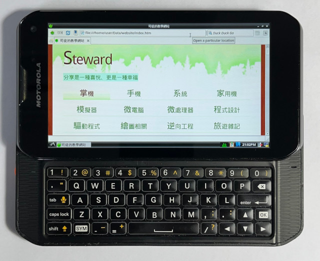

**VNC Client for XT897 smartphone on SailfishOS.**  
You can now run Debian 12 on the XT897 smartphone using a chroot environment with a VNC server, and access it through a VNC client running on SailfishOS.  

&nbsp;

## Introduction
Due to the lack of mainstream kernel support for the XT897 smartphone, the SailfishOS container cannot run properly on this device. To work around this limitation and run Debian 12 (Bookworm) on the XT897, I use a chroot environment with a VNC server. However, the default VNC client available on SailfishOS did not meet my requirements. As a result, I ported a VNC client based on the LibVNC example specifically for the XT897 and added additional features, such as keyboard and mouse support. This repository is specifically designed for the XT897 smartphone and has only been tested with SailfishOS version 4.4.0.68. 

